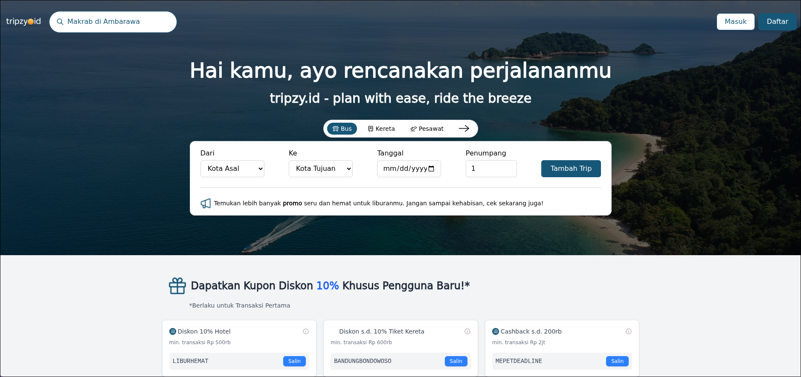

# Tripzy - Trip Management System

A project for trip management system built with Django and React TS using GraphQL API



## Features

- User management
- Create trip
- Create trip plans, e.g. hotel and transportation
- Invite another user to join your trips
- Expense report with cost breakdown for each member
- Trip reminder notification in D-7, D-3, and D-1 for the trip

## Tools Used

- Django
- GraphQL
- React TypeScript
- MySQL
- Docker

## Installation

```bash
git clone https://github.com/januarpancaran/tripzy.git
cd tripzy
cp .env.example .env
cd backend && cp .env.example .env
```

## Build Docker Images

```bash
docker compose up --no-start
docker compose start
```

## Edit Environment Variables

```bash
# Copy this output and paste it in .env file
docker compose exec backend python -c "from django.core.management.utils import get_random_secret_key; print(get_random_secret_key())"
```

## Start/Stop Docker Containers

```bash
# To start containers
docker compose start

# To stop containers
docker compose stop

# To rebuild containers
docker compose down
docker compose up --no-start
docker compose start
```
