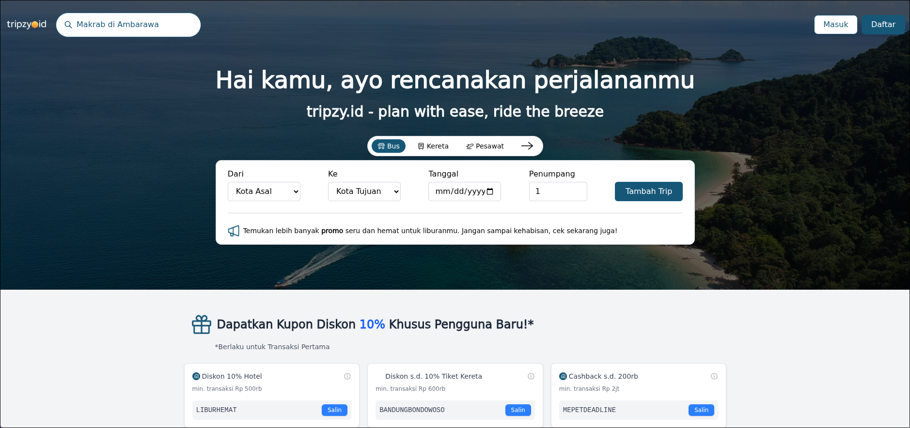

# Tripzy - Trip Management System

A project for trip management system built with Django and React TS using GraphQL API



## Features

- User management
- Create trip
- Create trip plans, e.g. hotel and transportation
- Invite another user to join your trips
- Expense report with cost breakdown for each member
- Trip reminder notification in D-7, D-3, and D-1 for the trip

## Tech Stack

- **Backend**: Django + GraphQL
- **Frontend**: React Typescript + Vite
- **Database**: MySQL
- **Real-time Tasks**: Celery + Redis

## Prerequisites

- Python 3.10+
- Node.js 16+
- MySQL 8.0+
- Redis (for Celery)

## Installation & Setup

### 1. Clone the repository

```bash
git clone https://github.com/januarpancaran/tripzy.git
cd tripzy
```

### 2. Backend Setup

```bash
cd backend

# Create virtual environment
python -m venv .venv
source .venv/bin/activate  # On Windows: .venv\Scripts\activate

# Install dependencies
pip install -r requirements.txt

# Copy environment file and configure
cp .env.example .env
# Edit .env with your MySQL credentials and Django secret key
```

### 3. Frontend Setup

```bash
cd frontend

# Install dependencies
npm install
```

### 4. Database Setup

```bash
cd backend

# Run migrations
python manage.py migrate

# Create superuser (admin)
python manage.py createsuperuser
```

## Running the Project

### Start Backend Server

```bash
cd backend
source .venv/bin/activate
python manage.py runserver
```

The GraphQL API will be available at `http://localhost:8000/graphql/`

### Start Frontend Development Server

```bash
cd frontend
npm run dev
```

The frontend will be available at `http://localhost:5173/`

### Start Celery Worker (for notifications)

```bash
cd backend
source .venv/bin/activate
celery -A core worker -l info
```
